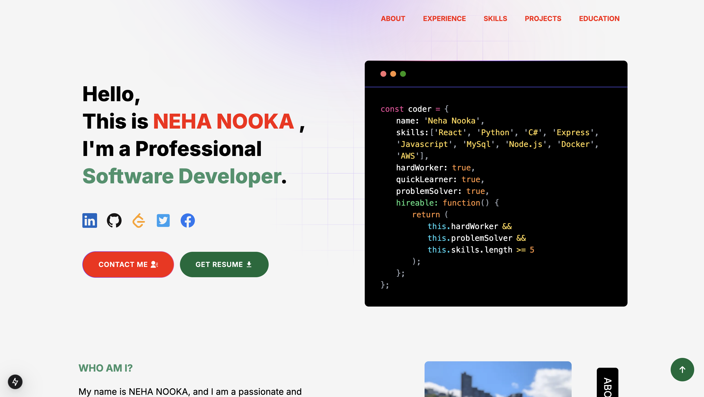

# [Built Portfolio With GitHub ](https://github.com/said7388/github-portfolio)

---

# Developer Portfolio

#### Are you struggling to create a professional portfolio website? Look no further! You can use the Developer Portfolio template and create your very own personalized portfolio today! My website is designed to be user-friendly and easily customizable, making it perfect for both developers and freelancers.

---

# Demo :movie_camera:



## View live preview [here](https://abusaid.netlify.app/).

---

## Table of Contents :scroll:

- [Sections](#sections-bookmark)
- [Demo](#demo-movie_camera)
- [Installation](#installation-arrow_down)
- [Getting Started](#getting-started-dart)
- [Usage](#usage-joystick)
- [Deployment](#deployment-rocket)
- [Tutorials](#tutorials-wrench)
  - [Gmail App Password Setup](#gmail-app-password-setup)
  - [Create a Telegram Bot](#create-a-telegram-bot)
  - [Fetching Blog from dev.to](#fetching-blog-from-devto)
- [Packages Used](#packages-used-package)

---

# Sections :bookmark:

- HERO SECTION
- ABOUT ME
- EXPERIENCE
- SKILLS
- PROJECTS
- EDUCATION
- CONTACTS

---

# Installation :arrow_down:

### You will need to download Git and Node to run this project

- [Git](https://git-scm.com/downloads)
- [Node](https://nodejs.org/en/download/)

#### Make sure you have the latest version of both Git and Node on your computer.

```bash
node --version
git --version
```

## <br />

# Getting Started :dart:

### Fork and Clone the repo

To Fork the repo click on the fork button at the top right of the page. Once the repo is forked open your terminal and perform the following commands

```bash
git clone https://github.com/<YOUR GITHUB USERNAME>/developer-portfolio.git

cd developer-portfolio
```

### Install packages from the root directory

```bash
npm install
# or
yarn install
```

Then, run the development server:

```bash
npm run dev
# or
yarn dev
```

Open [http://localhost:3000](http://localhost:3000) with your browser to see the result.

---

### Running with Docker Compose

1. **Build Docker Image and Run Container**:

   ```bash
   docker-compose up --build
   ```

2. **Access the Application**:
   Visit [http://localhost:3000](http://localhost:3000) in your web browser to view the running application.

---

### Building the Docker Image

1. **Build the Docker Image using Dockerfile.dev**:

   ```bash
   docker build -t nextjs-app -f Dockerfile.dev .
   ```

2. **Running the Docker Container**:

   ```bash
   docker run -p 3000:3000 nextjs-app
   ```

3. **Access the Application**:
   Visit [http://localhost:3000](http://localhost:3000) in your web browser to view the running application.

---

# Usage :joystick:

Please create a new `.env` file from `.env.example` file.

Eg:

```env
NEXT_PUBLIC_GTM =
NEXT_PUBLIC_APP_URL =
TELEGRAM_BOT_TOKEN =
TELEGRAM_CHAT_ID =
GMAIL_PASSKEY =
EMAIL_ADDRESS =
```

### Then, Customize data in the `utils/data` [folder](https://github.com/said7388/developer-portfolio/tree/main/utils/data).

Eg:

```javascript
export const personalData = {
  name: "NEHA NOOKA",
  profile: "/profile.jpeg",
  designation: "Software Developer",
  description:
    "My name is NEHA NOOKA, and I am a passionate and dedicated programmer with a strong drive for learning and exploring new technologies. I am a quick learner with a self-motivated approach, always eager to solve challenging problems and create impactful solutions.",
  description2:
    "My expertise spans multiple areas of web and software development, with a strong foundation in JavaScript and a keen interest in building dynamic, user-friendly applications. I thrive on making technology accessible and effective, contributing to innovative projects that leave a mark. I am open to exciting job opportunities that align with my skills and passion for development.",
  email: "nookaneha@gmail.com",
  phone: "+16673358435",
  address: "Seattle WA, USA (Open to relocation)",
  github: "https://github.com/NehaNooka",
  facebook: "https://www.facebook.com/NehaNooka/",
  linkedIn: "https://www.linkedin.com/in/neha-nooka/",
  twitter: "https://twitter.com/nehanooka",
  stackOverflow: "https://stackoverflow.com/users/29148012/neha-nooka",
  leetcode: "https://leetcode.com/u/nehanooka/",
  devUsername: "nehanooka",
  resume:
    "https://drive.google.com/file/d/1nzo6AEhlryO4dxACzpd0Hw8Krm0fuA_C/view?usp=sharing",
};
```

`devUsername` is used for fetching blog posts from `dev.to`.

---

# Deployment :rocket:

Deploying the app to platforms like Vercel or Netlify is quick and easy.

## Deploying to Vercel:

1. **Sign up or log in** to [Vercel](https://vercel.com/).
2. Once logged in, click on **"New Project"**.
3. Select your **GitHub repo** (the one that contains your forked project) and click **Import**.
4. Configure your environment variables in the Vercel dashboard by adding each key from your `.env` file.
   - E.g., `NEXT_PUBLIC_GTM`, `NEXT_PUBLIC_APP_URL`, `TELEGRAM_BOT_TOKEN`, etc.
5. Click on **Deploy**. Vercel will automatically detect your Next.js app and build it.
6. Once the deployment is complete, you can visit your live website!

### Updating After Deployment

Whenever you push changes to your GitHub repo, Vercel will automatically redeploy the app, keeping your portfolio up-to-date.

## Deploying to Netlify:

1. **Sign up or log in** to [Netlify](https://www.netlify.com/).
2. In the **Netlify Dashboard**, click **"New site from Git"**.
3. Connect your **GitHub** account and select your repo.
4. Configure your environment variables by going to **Site Settings > Build & Deploy > Environment** and adding keys from your `.env` file.
5. Click **Deploy Site**. Netlify will build and deploy your portfolio.

---

# Packages Used :package:

|   Used Package List    |
| :--------------------: |
|    @emailjs/browser    |
|  @next/third-parties   |
|         axios          |
|      lottie-react      |
|          next          |
|       nodemailer       |
|         react          |
|       react-dom        |
|   react-fast-marquee   |
| react-google-recaptcha |
|      react-icons       |
|     react-toastify     |
|         sharp          |
|          sass          |
|      tailwindcss       |

---

# FAQ:

1. For those facing the issue of "`next` is not recognized as an internal or external command, operable program or batch file."

Run the following command:

```bash

npm install -g next

```

This installs Next.js globally

then do the usual `npm run dev`
